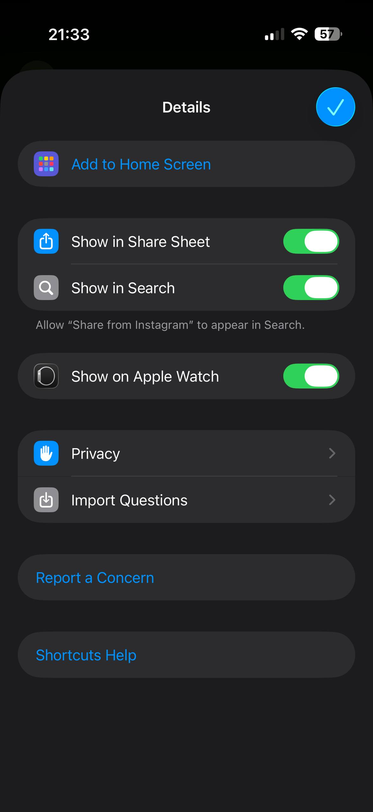

# KKInstagram Link Cleaner (iOS Shortcut)

A tiny but useful **iOS Shortcut** that converts Instagram share links into clean, lightweight KKInstagram URLs that can be used in Discrod, Telegram etc. 

This shortcut is designed for people who want to:

- Open Instagram Reels without the app  
- Remove tracking query parameters (`?igsh=...`)  
- Quickly copy a clean link to clipboard  
- Share Instagram content in a simpler format  

## How to install

You can download binary file [ShareFromInstagram.shortcut](https://github.com/alexander-zolkin/iOS-Instagram-share-stortcut/raw/refs/heads/main/ShareFromInstagram.shortcut) and import it in your Shortcuts application, [download it from iCloud](https://www.icloud.com/shortcuts/3e9a8209fceb44fd8c34d291be1a22d3) or rewrite it from this screenshot 😉

[](screenshots/shortcut_body.jpg)

## How to use

Make sure to enter shortcut settings page and enable/import it everywhere you want.

[](screenshots/shortcut_settings.jpg)

Now you can add this shortcut into the Control Center or home page, so if there is an Instagram link in your clipboard, it will be affected on usage. Also you can use this shortcut right from the Share Sheet now.

## ✨ Features

✅ Converts:

- `instagram.com/...`
- `www.instagram.com/...`
- `https://instagram.com/...`
- `https://www.instagram.com/...`

into:

- `https://www.kkinstagram.com/...`

✅ Removes all query parameters:

- `?igsh=...`
- `?utm_source=...`
- anything after `?`

✅ Copies the cleaned URL automatically

## Example

### Input

```text
https://www.instagram.com/reel/DQ_OK1KDDFt/?igsh=M3hndjdhMmZqMjZnabc123def
```

### Output

```
https://www.kkinstagram.com/reel/DQ_OK1KDDFt/
```